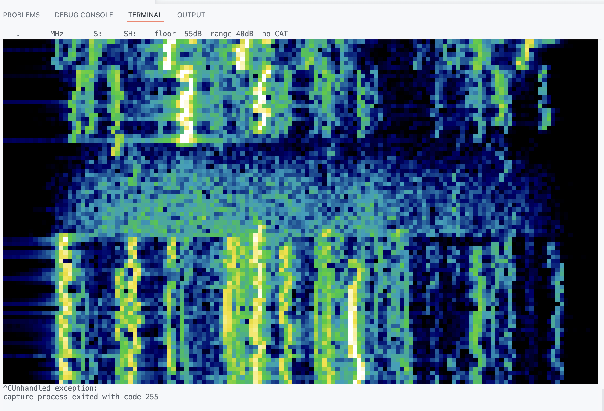

# needle

Pure-Dart CAT control and real-time audio spectrum tooling for the **Yaesu FT-891**.

A proof of concept for a Flutter touchscreen front panel. It exists to prove two
things work in Dart before any UI is built on top of them:

1. A CAT request/response loop that survives a radio being used, not just idled.
2. A real-time FFT of the receiver's audio at a usable frame rate.

Then it puts them together in a terminal waterfall.

`lib/` is **Flutter-free by design** and enforced by a test. The eventual Flutter
app consumes this package unchanged via a path dependency.



*20m FT8 received on an FT-891 through a Digirig, rendered with 24-bit colour
half-block cells. Each vertical streak is one station; the quiet band across the
middle is the gap between FT8's 15-second transmit cycles. Captured audio-only —
run with `--port` as well and the header carries live frequency, mode, S-meter
and filter width.*

---

## Status

| Criterion | Result |
|---|---|
| §3.1 `ports` identifies the CP2105 Enhanced port | pass — `--probe` confirms `FT-891 at 38400 baud` |
| §3.2 `cat --watch` survives 60 s of knob spinning | pass — 1164 responses, **0 desyncs, 0 timeouts, 0 resyncs** |
| §3.3 recovers from a mid-run power cycle | pass — `ready → degraded → connecting → ready`, 0 desyncs |
| §3.4 `audio --peak` tracks a real signal | capture verified; needs a tune-across-carrier check |
| §3.5 FT8 visible as discrete lines on 14.074 | **pass** — see the screenshot above |
| §3.6 `scope --mock` runs with no hardware | pass — 12% of columns persistently bright, discrete lines |
| §3.7 clean analysis, tests, malformed-input coverage | pass — 179 tests, `dart analyze --fatal-infos` clean |

Measured on the real radio at 38400: round trips of **5–13 ms**
(`IF;` median 12 ms, everything else 5–6 ms). FFT throughput is **~5700 fps**
across the isolate boundary against a 15 fps target.

---

## Install

```bash
brew install libserialport ffmpeg     # macOS
sudo apt install libserialport-dev alsa-utils   # Debian / Raspberry Pi

dart pub get
```

### macOS: `LIBSERIALPORT_PATH` is required

`package:libserialport` calls `DynamicLibrary.open('libserialport.dylib')`, and
dyld does **not** search `/opt/homebrew/lib` on Apple Silicon. Without this the
tool reports that it cannot load the native library:

```bash
export LIBSERIALPORT_PATH=/opt/homebrew/lib/libserialport.dylib
```

Linux needs nothing — `apt` installs into the default search path.

---

## Radio setup

Set these in the FT-891 menu before use. The CAT rate matters most: at the
factory default nothing answers, and a wrong rate does **not** produce silence —
it produces plausible-looking framing garbage.

| Menu | Setting | Value | Why |
|---|---|---|---|
| 05-06 | CAT RATE | **38400** | 4800 cannot sustain 10 Hz meter polling |
| 05-07 | CAT TOT | 1000 ms | Also the length of the post-rejection dead window |
| 05-08 | CAT RTS | OFF | Unless you are using RTS PTT |
| 08-05 | DATA LCUT FREQ | **OFF** | Otherwise the waterfall loses low-end bandwidth |
| 08-07 | DATA HCUT FREQ | **OFF** | Otherwise it loses high-end bandwidth |
| 08-11 | DATA OUT LEVEL | tune for ~50% | `audio --peak` reports real dBFS to aim at |

08-05 and 08-07 must be OFF or the DATA output is pre-filtered and the waterfall
is cropped at both ends.

### Wiring

```
FT-891 rear USB-B ──► Silicon Labs CP2105 (dual) ──► two virtual serial ports
                                                     Enhanced = CAT
                                                     Standard = PTT/RTS, not CAT
FT-891 DATA jack ────► Digirig ────────────────────► USB sound card
```

---

## Usage

```bash
needle ports                       # list serial ports, flag the likely CAT port
needle ports --probe               # open each candidate and ask the radio to identify itself
needle devices                     # list audio inputs, flag the likely Digirig

needle cat --port <p> --send "FA;" # one-shot command
needle cat --port <p> --watch      # live state, ends with a health verdict
needle cat --port <p> --record f   # capture a fixture transcript

needle audio --device <d> --peak   # dominant frequency, dBFS and SNR
needle audio --device <d> --bins   # magnitude array as CSV

needle scope --port <p> --device <d>   # the full demo
needle scope --mock                    # no hardware required

needle tx --port <p> --allow-transmit  # guarded test transmission
```

Global flags: `--verbose` (round-trip timings and raw serial traffic),
`--log <file>`, `--baud` (default 38400).

### Finding your ports

A single CP2105 can appear **four** times on macOS, because Apple's built-in
CP210x driver and the Silicon Labs DriverKit extension each publish a node for
both interfaces. `needle ports` greys the duplicates and flags one candidate:

```
  ✓ /dev/cu.usbserial-00B61C5C0
      vid=0x10C4 pid=0xEA70 serial=00B61C5C
      CP2105 interface 0 = Enhanced
  · /dev/cu.SLAB_USBtoUART6
      same UART as /dev/cu.usbserial-00B61C5C0 (other driver)
```

Note that `SLAB_USBtoUART6` is the **Enhanced** port while plain
`SLAB_USBtoUART` is Standard — picking the lower-numbered device selects PTT,
not CAT.

---

## Transmit safety

**Default to never transmitting.** `needle tx` refuses without
`--allow-transmit`, and there is no path to a key-down from any other command.
A watchdog un-keys unconditionally after 10 seconds, an exception during
key-down still un-keys, and SIGINT un-keys before exiting.

> **The FT-891 has no `RX` command.** Its command table runs RA, RC, RD, RG, RI,
> RL, RM, RS, RU — no RX — and the radio answers `?;` to it. Un-keying is
> `TX0;`. A test greps `lib/` to prove no source file can send `RX;`, because
> doing so would leave the transmitter keyed.

Only ever test into a dummy load.

---

## Notes from the hardware

Things that cost real time to discover, recorded so they cost nobody else any.

**After the radio answers `?;` it ignores CAT for a full second.** Measured:
commands sent 0.4–0.9 s after a rejection were all silently discarded; 1.0 s and
beyond always worked. That threshold is menu 05-07 CAT TOT. So a rejection costs
far more than the rejected command, and the queue must go *quiet* rather than
merely not retry. A corollary: never send a bare `;` to "flush" the link — it is
itself invalid, so it triggers the dead window it was meant to clear.

**`SerialPortConfig.dispose()` plus `SerialPort.dispose()` aborts the process.**
Either alone is safe. Configs also cannot be reused across ports — the second
apply fails with `ETIMEDOUT`. needle builds a fresh config per open and never
disposes it.

**`SerialPortReader` is unusable here.** It hands a raw `Pointer<sp_port>` to a
spawned isolate and only stops it asynchronously, so closing the port frees the
struct mid-read. Since resync is built on close/reopen, needle runs its own 2 ms
read pump instead.

**`ready` must mean the radio is answering, not that the port opened.** The
CP2105 node can survive a power cycle, so a successful reopen proves nothing.

**`SH` returns a table index, not a bandwidth.** The same index means
different things per mode: 14 is 2400 Hz in wide SSB but 1700 Hz in wide CW,
and narrow SSB does not offer it at all. The table is transcribed in
`lib/src/cat/filter_widths.dart`; gaps the book prints as dashes are null
rather than guessed.

**The S-meter zero glitch is auto-info-specific.** Spec §5.7 warns of bogus
`SM0000` readings during knob motion; a real 60-second capture under hard
spinning produced **zero** in 118 reads. Re-reading the spec, it describes them
"during auto-info bursts" — polling never enters that state. The debouncer
remains as insurance for `--auto-info`.

---

## Development

```bash
dart analyze --fatal-infos
dart test
```

`test/layering_test.dart` enforces the architectural rules: `dsp/` never imports
`cat/`, nothing in `lib/` mentions Flutter, nothing outside `cli/` writes to the
console, and no code path can send `RX;`.

## Licence

MIT. Note that the `libserialport` Dart wrapper is LGPL-3.0; if you distribute a
compiled binary, that carries a relink obligation.
